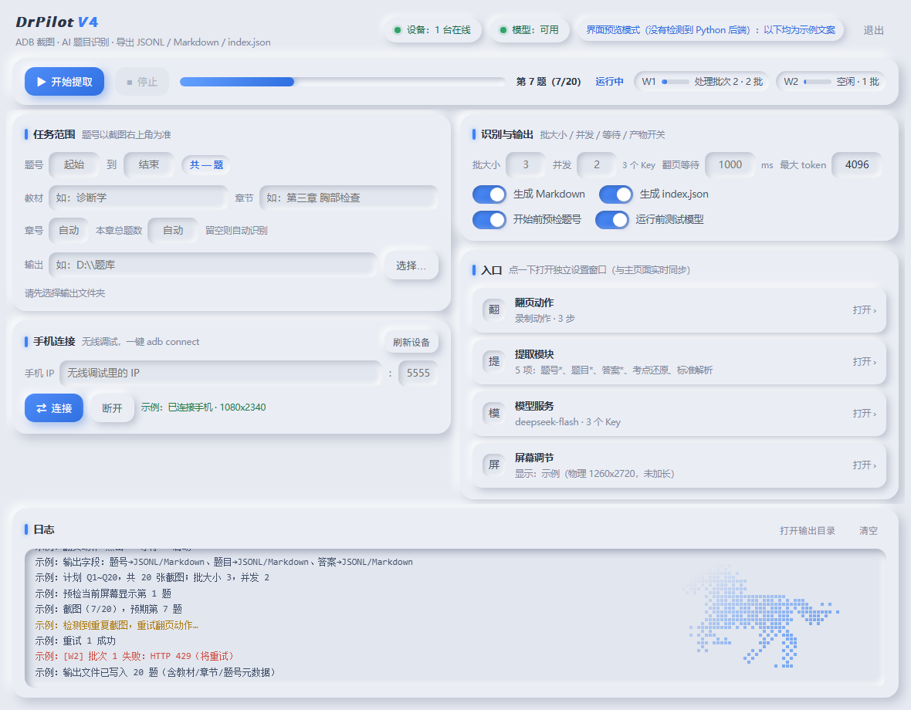
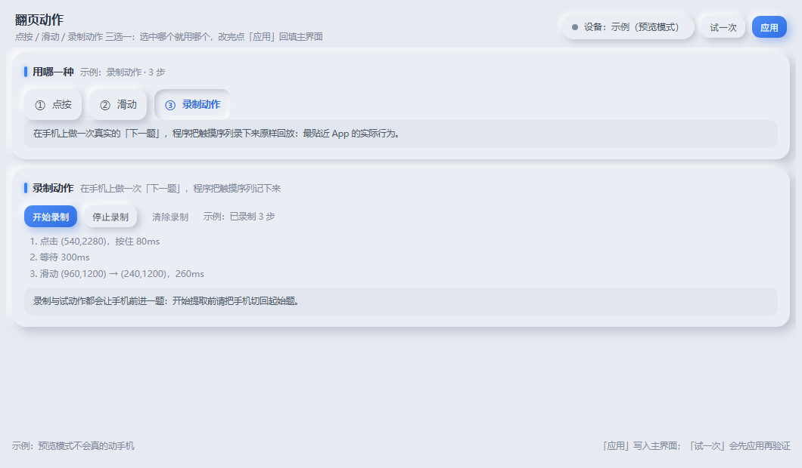
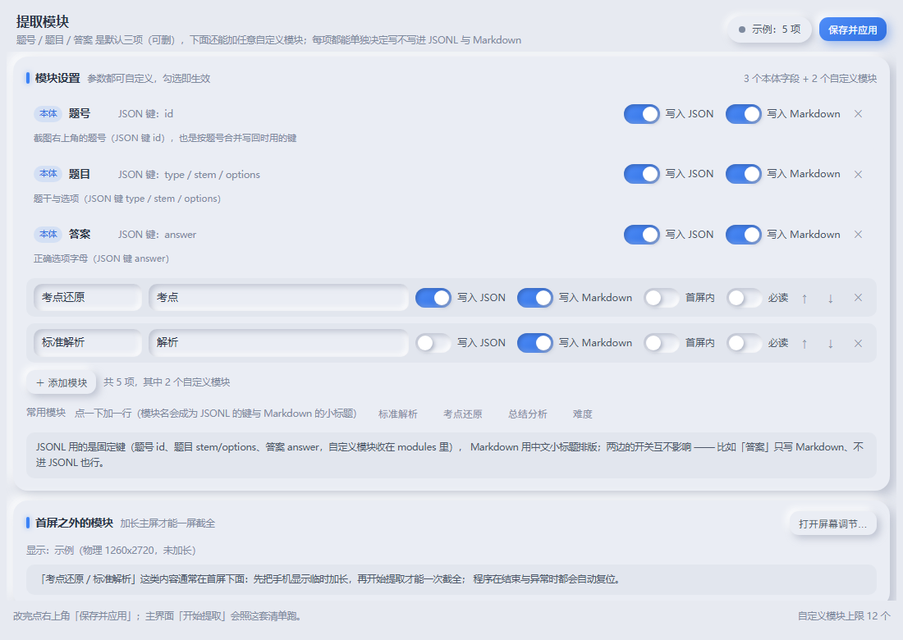
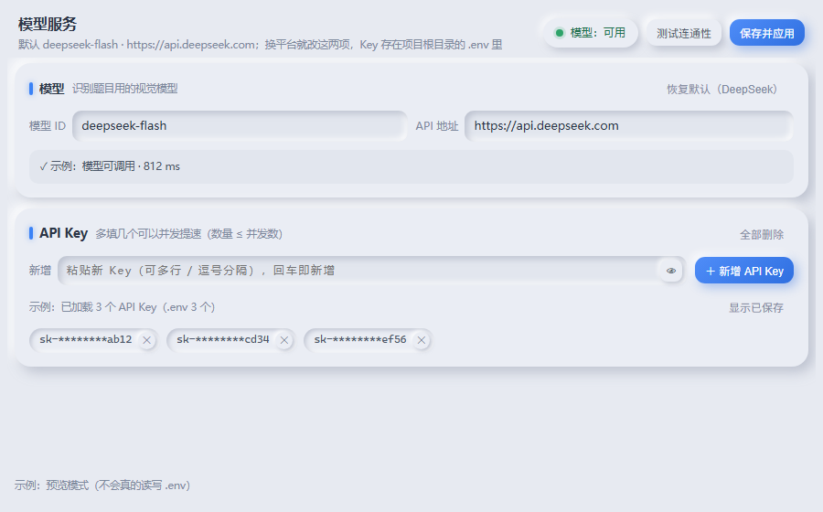
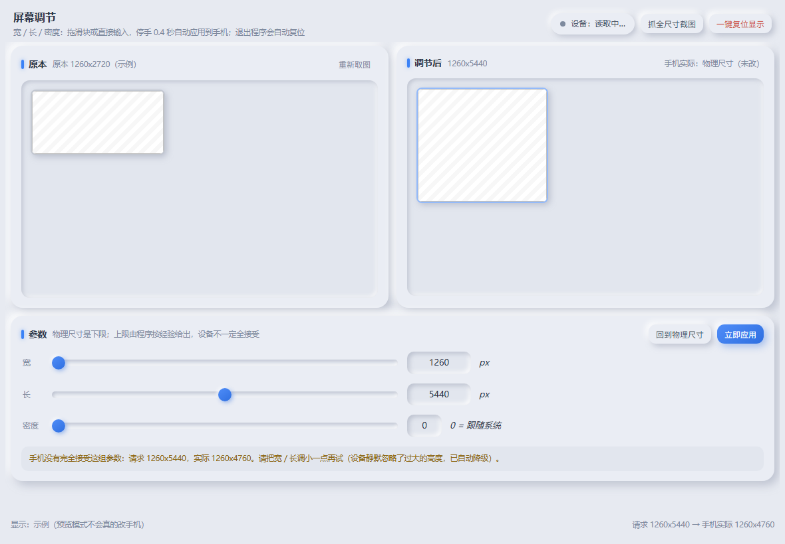

# DrPilot v4

**用 ADB 让手机自己翻页 + 截图，交给视觉大模型认成题目，按章节导出 JSONL + Markdown + 索引。**
命令行、图形界面、一句自然语言，三种用法随便挑；**手机端不用装任何东西**。

> 不需要 AutoX.js / Tasker / 无障碍脚本，也不用 root——程序只用系统自带的 `adb`：
> `adb shell input` 翻页，`adb screencap` 截图。手机连上（USB 或无线调试授权一次）就能跑。

---

## 特点

| 特点 | 说明 |
| --- | --- |
| **所见即所得** | 题号**以截图右上角显示的数字为准**（显示 `16/53` 就是第 16 题），不是程序顺序号。所以可以从任意一题开始、也能只补录漏掉的那一题，后面的编号不会被带偏。 |
| **通用性高** | 翻页动作支持**点按 / 滑动 / 录制**三种适配方式（录制直接读设备 `getevent`，把你手上的「下一题」手势原样存下来）；坐标按「基准分辨率」自动缩放到别的机型。换个刷题 App、换台手机都不用改代码。 |
| **手机零安装** | 纯 adb 驱动屏幕，手机端不装脚本、不装自动化框架、不用 root。 |
| **三种用法** | CLI（参数化，脚本/Agent 友好）、GUI（点鼠标，五个窗口）、自然语言（`--text "药理学第二章 47到81题，存到 D:\题库"`）。 |
| **首屏之外一次截全** | `--modules 考点还原,标准解析` + `--display wide`：运行期间临时加长/加宽手机逻辑屏，把第一屏下面的「考点还原 / 标准解析」也截进同一张图。仍是一题一张截图，不拼接、不降分辨率，结束或异常自动复位。 |
| **产出直接喂给 AI** | 一行一题的 JSONL（每行自带教材/章节/题号）、人读的 Markdown、可定位的 `index.json`。AI 拿到任意一行都知道出处，不必把整章塞进上下文。 |
| **跑批稳** | 跑前 `doctor` 自检 7 项、开始前题号预检、重复截图自动重试、翻页卡住立刻停、失败只写占位并给出补录命令、多 Key 轮换并发、Key 全程脱敏、每次运行都写日志。 |

## 工作原理

```
手机上的刷题 App（背题模式：正确选项前有勾选圆圈）
   │ ①  adb input 翻页（点按 / 滑动 / 录制动作）
   │ ②  adb screencap 截图（可选：临时加长逻辑屏，一屏装下整页）
   ▼
视觉大模型（OpenAI 兼容接口，默认 DeepSeek）
   │ ③  逐张识别：题号 / 题型 / 题干 / 选项 / 答案 〔+ 考点还原 / 标准解析 …〕
   ▼
④  <教材>_<章号>_<章节>.jsonl + .md + index.json（同章节按题号合并写回）
```

## 快速开始

```bash
git clone https://github.com/bcao543/DrPilot_V4 && cd DrPilot_V4
uv sync                    # 1) 建环境、按 uv.lock 装依赖（需要 Python 3.13+ 和 uv）
uv run drpilot doctor      # 2) 自检：能不能跑、缺什么、怎么修，逐条给建议
uv run drpilot --gui       # 3) 打开图形界面（命令行用法见下）
```

前置条件三样：

1. **`adb`**：Android platform-tools，手机开启 USB 调试（或无线调试）并授权；
2. **Python 3.13+ 与 [uv](https://docs.astral.sh/uv/)**；
3. **API Key**：图形界面「模型服务 → API Key」粘贴后点「＋ 新增 API Key」（写入项目根目录 `.env`），
   或复制 `.env.example` 为 `.env` 自己填。

提取前把 App 切到**背题模式**（正确选项前有勾选圆圈）——AI 靠勾选判断答案。

## 使用教程

### 1. CLI：一条命令提取一段

```bash
# 药理学 第二章 1~20 题 → D:\题库
uv run drpilot --from 1 --to 20 --output-dir D:/题库 \
    --textbook 药理学 --chapter "第二章 药物代谢动力学"
```

必填三个：`--from`（起始题号）、`--to`（结束题号，包含）、`--output-dir`（输出文件夹）；
`--textbook` / `--chapter` 决定文件名与元数据。先空跑看一遍参数与输出路径：

```bash
uv run drpilot --from 1 --to 20 --output-dir D:/题库 --dry-run --json
```

### 2. 自然语言：让 CLI 自己解析参数

```bash
uv run drpilot --text "药理学第二章 47到81题，存到 D:\题库" --json
uv run drpilot ask --from 47 --json     # 只回答：还缺什么、该问用户什么、凑齐后跑什么
```

`--text` 只解析有把握的部分（题号区间、输出目录、教材章节、手机地址、"先别跑"、要哪些提取模块、
要不要加长屏），解析不出来的仍以 `missing` / `questions` 返回；**显式命令行参数永远优先**。

### 3. GUI：五个窗口

```bash
uv run drpilot --gui
```

| 窗口 | 干什么 |
| --- | --- |
| **主页面** | 任务范围 / 手机连接 / 识别与输出 三张卡 + 运行日志，点「开始」就跑 |
| **翻页动作** | 点按 / 滑动 / 录制三选一；「试一次」会对比动作前后截图，确认动作真的翻页了 |
| **提取模块** | 勾选要额外提取的内容块（考点还原、标准解析…），并决定它进 JSON 还是 Markdown |
| **模型服务** | 模型 ID、接口地址、API Key 增删（脱敏显示）、连通性测试 |
| **屏幕调节** | 宽 / 长 / 密度三个滑块，左「原本」右「调节后」实时对比，另有「抓全尺寸截图」「一键复位显示」 |

每个窗口里的改动都会**实时回填主页面**，开始提取时用的始终是同一套值；退出程序会复位手机显示设置。

| 主页面 | 翻页动作 |
| --- | --- |
|  |  |
| **提取模块** | **模型服务** |
|  |  |



### 4. 常见场景

```bash
# 从任意一题开始（开始前会先截一张图做预检，屏幕题号与 --from 不一致会拦下来）
uv run drpilot --from 47 --to 60 --output-dir D:/题库 --textbook 药理学 --chapter "第二章 药物代谢动力学"

# 漏了第 17 题：只补这一题；同目录按题号合并写回，其它题不受影响
uv run drpilot --from 17 --to 17 --output-dir D:/题库 --textbook 药理学 --chapter "第二章 药物代谢动力学"

# 接着上次没跑完的继续：同样的 --output-dir + 还没跑的题号区间（已存在的题号会合并）

# 首屏之外的「考点还原 / 标准解析」：加长屏 + 提取模块
uv run drpilot --from 1 --to 20 --output-dir D:/题库 \
    --textbook 医学微生物学 --chapter "第九章 球菌" \
    --modules 考点还原,标准解析 --display wide --batch-size 2 --max-tokens 8192 --json

# 先肉眼确认「加长屏能不能把这页截全」：只截当前题存 PNG，不调 AI、不需要 Key
uv run drpilot capture --from 1 --output-dir D:/题库 --display wide --json
```

### 5. 换个刷题 App / 换台手机怎么适配

1. **录一次翻页动作**：GUI「翻页动作」→「开始录制」→（按钮会变成「结束录制」）在手机上做一次
   「下一题」的手势（点按钮、左右滑动都行）→ 点「结束录制」→「试一次」。程序会对比动作前后的
   截图，画面变了就说明录对了。
2. **坐标自适应**：录制时会把当时的分辨率记成「基准分辨率」，以后换机型按比例自动缩放；
   也可以用 `--tap 630,2380`（纯点击类）或 `--swipe-start-x/-y --swipe-end-x/-y` 手写坐标。
3. **内容被折叠**：`--display wide`（或 `--display-scale` / `--display-width-scale` /
   `--display-density`）临时加长、加宽、改密度；程序回读校验，设备不接受的尺寸自动降级，
   结束或异常都会复位（被强杀后 `drpilot display --reset` 兜底）。
4. **题号**：只要 App 右上角显示「当前题号 / 总题数」，程序就能按题号工作——从任意一题开始、漏哪题补哪题。

## 输出物

| 文件 | 用途 |
| --- | --- |
| `<教材>_<章号>_<章节>.jsonl` | **主产物**：一行一题，每行自带教材 / 章节 / 题号元数据 |
| `<教材>_<章号>_<章节>.md` | 人读版（可关：`--no-md`） |
| `index.json` | 索引：教材 → 章节 → 文件 → 已有题号列表（可关：`--no-index`） |

真实的 JSONL 一行（配了 `--modules` 才会多出 `modules` 这个键）：

```json
{"id": 2, "textbook": "医学微生物学", "chapter": "球菌", "chapter_no": 9, "total": 287, "type": "single", "stem": "下列哪项不是致病性葡萄球菌重要的鉴定依据", "options": {"A": "金黄色色素", "B": "血平板上溶血", "C": "凝固酶阳性", "D": "耐热核酸酶", "E": "发酵葡萄糖"}, "answer": "E", "modules": {"考点还原": "（医学微生物学P26）……", "标准解析": "……"}}
```

- `id` 就是截图右上角的数字；每行自包含出处，文件改名、单独取用都不丢上下文。
- 同章节再次运行时**按 `id` 合并写回**：补录不会覆盖别的好数据，本次没认出来的题会保留文件里的旧内容。
- 模块名同时是 JSONL 的键名与 Markdown 的小标题。

Markdown 固定格式（便于再解析）：

```markdown
## 第 2 题 【单选题】
下列哪项不是致病性葡萄球菌重要的鉴定依据
A. 金黄色色素  
B. 血平板上溶血  
### **答案：E**
### **考点还原**
（医学微生物学P26）……
### **标准解析**
……
```

## 模块与功能

### 命令一览

| 命令 | 作用 |
| --- | --- |
| `drpilot --from … --to … --output-dir …` | 提取（主命令） |
| `drpilot doctor [--full]` | 环境自检：python / 依赖 / API Key / 配置 / adb / 输出目录 / 模型连通性 |
| `drpilot ask [--text "…"]` | 只回答：还缺什么参数、该问用户什么、凑齐后跑什么命令 |
| `drpilot schema` | 机器可读的完整契约（参数 / 退出码 / 危险参数 / 常用套路） |
| `drpilot devices` | 列出 adb 设备 |
| `drpilot check-model` | 只测模型连通性（平台下架模型时第一时间发现） |
| `drpilot modules` | 可用提取模块目录 + 当前配置 |
| `drpilot display [--probe 2.0 \| --reset]` | 看手机显示设置 / 试一次加长（自动复位）/ 残留时一键复位 |
| `drpilot capture --from N --output-dir DIR` | 只截当前题存 PNG（按当前显示设置，不调 AI、不需要 Key） |
| `drpilot --gui` | 图形界面 |
| `drpilot -i` | 缺参数时逐项提问（TTY 下缺参数也会自动进入） |

子命令与扁平写法等价（`drpilot doctor` ≡ `drpilot --doctor`），所有命令都支持 `--json`：
**stdout 只有一份 JSON，日志走 stderr**，方便脚本和 Agent 直接读。

### 提取模块（首屏之外的内容）

内置预设（`drpilot modules --json` 可查）：**考点还原、标准解析、总结分析、技巧点拨、难度、统计、
标签、来源、笔记、评论、纠错**。模块名就是你想要的键名，也可以自定义：

```bash
--modules 考点还原,标准解析        # 模块名 → JSONL 的键 + Markdown 的小标题
--display wide                    # 这些内容通常在第一屏下面，加长屏一次截全
--batch-size 2 --max-tokens 8192  # 模块正文长：批小一点、单次回复上限大一点
```

- 截图里没有的内容一律留空（提示词明确**禁止编造**）；`required` 模块缺失会在日志与
  `diagnostics.missing_modules` 里点名题号，按题号补录即可。
- 每个模块可单独控制是否进 JSONL / Markdown（GUI「提取模块」窗口里勾）。

### 四种驱动方式

- **CLI**：参数化 + `--json` + 明确退出码（0 成功 / 1 跑失败可续跑 / 2 参数错 / 3 环境不可用 / 4 预检未过）。
- **GUI**：五个窗口，不用记参数；「模型服务」里管 Key（脱敏显示）。
- **自然语言**：`--text "…"` 一句话落成参数，缺的部分照旧以问题返回。
- **AI Agent**：`AGENTS.md` 是给 Agent 的操作手册；`schema --json` / `ask --json` 让它自己补齐参数，
  失败时按 `error_code`、`retry_command`、`diagnostics.question_numbers` 续跑。

## 常用参数速查

| 参数 | 说明 |
| --- | --- |
| `--from N` / `--to M` | 起始 / 结束题号（**以截图右上角为准**，不是页码） |
| `--output-dir DIR` | 输出文件夹 |
| `--textbook` / `--chapter` | 教材 / 章节（文件名与元数据） |
| `--modules A,B` | 额外提取的内容块（见上） |
| `--display wide` | 临时加长逻辑屏（默认高度 ×2），一屏截全整页 |
| `--display-scale` / `--display-width-scale` / `--display-density` | 加长倍数 / 加宽倍数 / 改密度（字变小，一屏装更多） |
| `--batch-size N` / `--max-tokens N` | 一次喂几张截图 / 单次回复上限 |
| `--workers N` | 并发 worker 数（不要超过 Key 数量） |
| `--connect IP:端口` | 无线调试：先连接再用 |
| `--wait` / `--wait-ms` | 翻页后等待（**默认 1 秒**；留够时间让 App 翻完页） |
| `--page-action auto\|tap\|swipe\|record` + `--tap x,y` / `--swipe-*` / `--next-action-file` | 翻页方式：录制动作 / 手动点按 / 滑动坐标 |
| `--dry-run` | 只校验参数、算出输出路径，不连手机、不调 AI |
| `--json` / `--debug` | 机器可读输出 / 记录 DEBUG 与堆栈 |

**危险参数（会改手机显示或跳过防错，慎用）**：`--display wide|scale|width-scale|density`
（临时改 `wm size/density`，结束或异常会自动复位，进程被强杀后用 `drpilot display --reset` 恢复）、
`--force-start`（跳过题号预检）、`--no-preflight`、`--no-model-check`、改 `--swipe-*` 坐标。

## 排障

| 症状 | 先做什么 |
| --- | --- |
| 不知道能不能跑 | `uv run drpilot doctor --full`（7 项逐条给修法） |
| 缺 Key / 模型不可用 | `drpilot doctor`、`drpilot check-model`；Key 在 GUI「模型服务」里加 |
| 手机找不到设备 | `drpilot devices`；检查 USB 授权或无线调试。**同一台手机同一时间只能归一个 adb 主机**：WSL 与 Windows 各有一个 adb server，换边前先 `adb kill-server` 再连 |
| 翻页没生效 | 日志出现「画面连续多次没有变化」时程序已停止截图（不会把同一张图当下一题）；到「翻页动作」重录或「试一次」，再按题号补录 |
| 题号对不上 | 日志有「截图显示第 X 题，与预期第 Y 题不一致」；把手机停到起始题再跑，或确认后用 `--force-start` |
| 有几题没认出来 | 结果 JSON 里给了 `failed_question_numbers` 与可直接照抄的 `retry_command` |
| 手机屏幕看着不对劲 | `drpilot display --reset`（加长屏残留） |
| 想知道细节 | 每次运行都写 `logs/drpilot-<时间>-<pid>.log`，结果 JSON 的 `log_file` 就是路径；`--debug` 更详细 |

> **题号错位的两个典型原因**：① 手机没停在起始题（预检会拦下来）；② **截图拍在翻页动画里**——
> 「翻页等待」设得太短时，画面还在横向滑动，新页右上角的题号还没进屏，模型只能读到上一页的题号，
> 于是整批编号慢一格。翻页等待保持 1 秒左右，或先用 `drpilot capture` 看一眼实际截图。

## 项目结构

```
src/drpilot/
  cli.py            命令行入口（参数、退出码、--json）
  pipeline.py       主流程：预检 → 截图 → 分批 → AI 识别 → 按题号写回
  ai.py prompts.py  模型调用与提示词（题号必须逐张从截图读，禁止照抄）
  parser.py models.py  回复解析与题目数据模型
  actions.py        翻页动作：录制 / 归一化 / 缩放 / 回放
  display.py        加长屏：应用 → 回读校验 → 自动降级 → 复位
  adb.py            设备连接与截图
  modules.py        提取模块（内置预设 + 自定义）
  output.py fileio.py  合并写出 JSONL / Markdown / index.json
  doctor.py         环境自检
  config.py keys.py 配置与 API Key（Key 只从环境变量 / .env 读）
  nlparse.py        自然语言 → 参数
  webui/            图形界面（pywebview，五个窗口）
tests/              单元测试（unittest）
tools/              ui_selftest.py（无头点遍五个页面）、ui_preview.py（渲染界面截图）
```

开发自检：

```bash
UV_PROJECT_ENVIRONMENT=$HOME/.venvs/drpilot_v4 uv run python -m unittest discover -s tests
uv run ruff check src tests
uv run python tools/ui_selftest.py
```

> 仓库**不含** `.env`、`drpilot_config.json`、`logs/`、`.venv/`：克隆下来是干净源码，
> 密钥与本地配置由你自己生成，且都已在 `.gitignore` 里。
> 一个仓库只留一个 `.venv`，且只属于一边（Windows 或 WSL）——细节见 [AGENTS.md](AGENTS.md)。

## 支持开发（打赏）

朋友，刷题软件里的题，复制费劲、导出没门、排版还乱？这工具一跑，题目乖乖出来。

GitHub 已开源，收款码就在下面。用着顺手，点个 Star；帮你省了时间，扫个码。五块不嫌少，五十不嫌多。

不是订阅，不是套路，就是请开发者喝杯咖啡，然后继续把工具磨快。别让写代码的人用爱发电，发到跳闸。

**Better Call the Dev。**

<p align="center">
  
  &nbsp;&nbsp;&nbsp;&nbsp;
  
</p>

